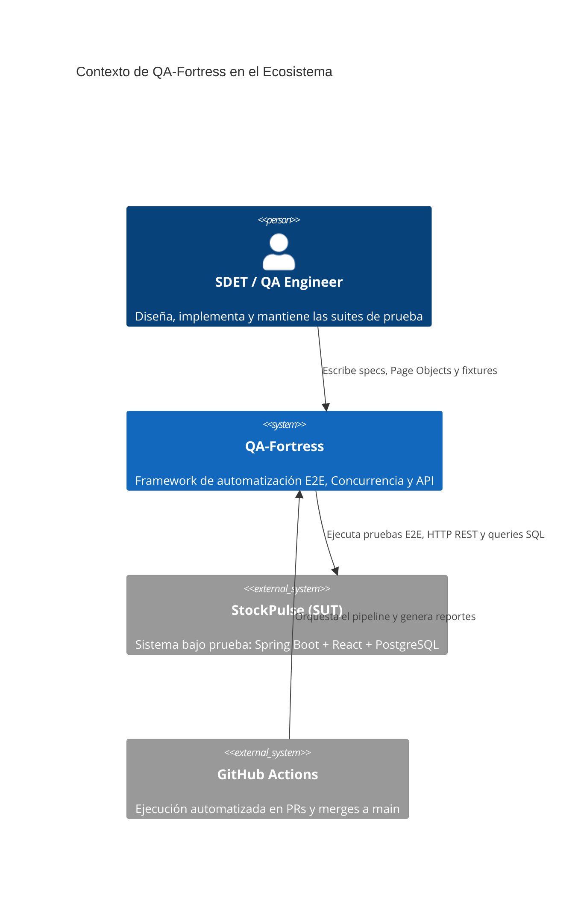
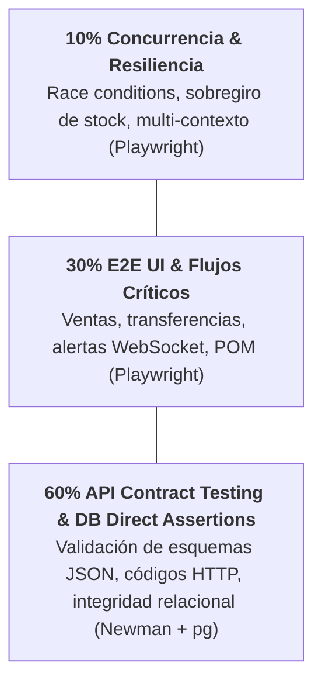
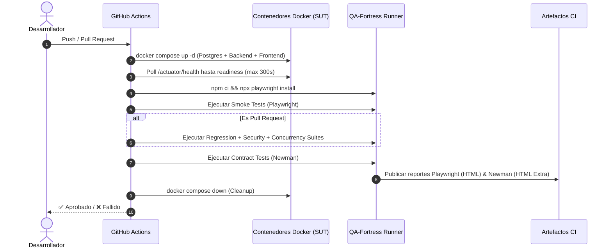

# 🏰 QA-Fortress — Enterprise Test Automation Framework & Quality Gate

[](https://nodejs.org/)
[](https://playwright.dev/)
[](https://www.typescriptlang.org/)
[](https://www.postman.com/)
[](https://www.postgresql.org/)
[](https://github.com/features/actions)

> **QA-Fortress** es un framework de automatización de pruebas integral y de grado de ingeniería diseñado como el **Quality Gate** central para [StockPulse](https://github.com/Roddorr2/stockpulse) (sistema distribuido de gestión de inventarios y ventas). Combina pruebas de interfaz de usuario con Playwright, contract testing de APIs REST con Postman/Newman, validaciones de concurrencia y aserciones de Nivel 2 directas sobre la base de datos PostgreSQL.

---

## 📑 Tabla de Contenidos

- [🏰 QA-Fortress — Enterprise Test Automation Framework \& Quality Gate](#-qa-fortress--enterprise-test-automation-framework--quality-gate)
  - [📑 Tabla de Contenidos](#-tabla-de-contenidos)
  - [🎯 Visión General y Objetivos](#-visión-general-y-objetivos)
  - [🏛️ Arquitectura y Pirámide de Pruebas](#️-arquitectura-y-pirámide-de-pruebas)
    - [Contexto del Sistema](#contexto-del-sistema)
    - [Pirámide de Pruebas Implementada](#pirámide-de-pruebas-implementada)
    - [Decisiones de Arquitectura Clave (ADRs)](#decisiones-de-arquitectura-clave-adrs)
  - [📂 Estructura del Proyecto](#-estructura-del-proyecto)
  - [🔍 Capas de Validación y Cobertura](#-capas-de-validación-y-cobertura)
    - [1. Smoke Testing (`@smoke`)](#1-smoke-testing-smoke)
    - [2. Regresión E2E (`@regression`)](#2-regresión-e2e-regression)
    - [3. Concurrencia y Carrera de Datos (`@concurrency`)](#3-concurrencia-y-carrera-de-datos-concurrency)
    - [4. Seguridad y Control de Accesos (RBAC)](#4-seguridad-y-control-de-accesos-rbac)
    - [5. Pruebas de Contrato de API (Postman / Newman)](#5-pruebas-de-contrato-de-api-postman--newman)
    - [6. Validaciones Directas en Base de Datos (Nivel 2)](#6-validaciones-directas-en-base-de-datos-nivel-2)
  - [⚙️ Requisitos Previos y Configuración](#️-requisitos-previos-y-configuración)
    - [Prerrequisitos](#prerrequisitos)
    - [1. Clonar e Instalar Dependencias](#1-clonar-e-instalar-dependencias)
    - [2. Instalar Navegadores de Playwright](#2-instalar-navegadores-de-playwright)
    - [3. Configurar Variables de Entorno](#3-configurar-variables-de-entorno)
  - [🚀 Guía de Ejecución de Pruebas](#-guía-de-ejecución-de-pruebas)
    - [Scripts de NPM Disponibles](#scripts-de-npm-disponibles)
    - [Comandos Avanzados de Playwright](#comandos-avanzados-de-playwright)
  - [🔄 Pipeline de CI/CD (GitHub Actions)](#-pipeline-de-cicd-github-actions)
    - [Características del Pipeline:](#características-del-pipeline)
  - [📊 Reportes y Evidencias](#-reportes-y-evidencias)
  - [📋 Matriz de Trazabilidad y Documentación](#-matriz-de-trazabilidad-y-documentación)
  - [🛡️ Principios de Diseño y Reglas para SDETs](#️-principios-de-diseño-y-reglas-para-sdets)

---

## 🎯 Visión General y Objetivos

QA-Fortress no es un conjunto de scripts aislados; es una **herramienta de ingeniería** concebida para integrarse en el ciclo de vida continuo del software. Sus objetivos principales son:

- **Feedback Rápido (< 2 min):** Validación inmediata de caminos críticos en cada `push` mediante suites `@smoke`.
- **Zero-Trust UI / Aserciones Cruzadas:** No confiar exclusivamente en la interfaz gráfica; auditar el estado final del negocio directamente en la base de datos (PostgreSQL).
- **Protección contra Sobregiro de Stock:** Simulación de condiciones de carrera con múltiples contextos y peticiones simultáneas sobre la última unidad disponible.
- **Aislamiento Total de Datos:** Creación de precondiciones efímeras vía API / DB Seeder y limpieza atómica (_teardown_) tras cada ejecución para evitar colisiones.
- **Prevención de Regresiones y Breaking Changes:** Validación estricta de esquemas de respuesta JSON y códigos HTTP en los endpoints REST.

---

## 🏛️ Arquitectura y Pirámide de Pruebas

### Contexto del Sistema



### Pirámide de Pruebas Implementada



### Decisiones de Arquitectura Clave (ADRs)

| ADR        | Decisión                                                | Alternativa Descartada          | Justificación                                                                                                   |
| ---------- | ------------------------------------------------------- | ------------------------------- | --------------------------------------------------------------------------------------------------------------- |
| **ADR-01** | **Page Object Model (POM) Estricto**                    | Selectores inline en specs      | Centraliza selectores e interacciones; si cambia la UI se ajusta un solo archivo (`e2e/pages/`).                |
| **ADR-02** | **Setup de Datos vía API / DB Seeder**                  | Setup navegando la UI           | Tests significativamente más veloces y no acoplados a posibles fallos visuales ajenos al test.                  |
| **ADR-03** | **API Contract Suite con Postman/Newman**               | Frameworks de API sobrecargados | Postman cubre al 100% el contract testing de endpoints REST, facilitando portabilidad en CI y exportación HTML. |
| **ADR-04** | **Aserciones Cruzadas UI/API + DB**                     | Confiar únicamente en la UI     | La UI puede cachear o presentar estados desactualizados; PostgreSQL es la única fuente de verdad definitiva.    |
| **ADR-05** | **Particionamiento por Tags (`@smoke`, `@regression`)** | Ejecución monolítica            | Permite feedback en segundos en cada push y reserva suites extensas/concurrencia para PRs a `main`.             |

---

## 📂 Estructura del Proyecto

```text
qa-fortress/
├── .github/
│   └── workflows/
│       └── qa-pipeline.yml            # Pipeline CI/CD en GitHub Actions
├── api-tests/
│   └── postman/
│       ├── StockPulse.postman_collection.json # Colección de Contract Tests
│       └── environments/
│           └── test.postman_environment.json  # Variables de entorno para Postman
├── db-validations/
│   └── sql/
│       ├── db-client.ts               # Cliente PostgreSQL reutilizable (DbHelper)
│       └── seeder.ts                  # Generador atómico de datos con teardown (TestSeeder)
├── docs/
│   ├── architecture.md                # Arquitectura y decisiones técnicas
│   ├── functional requirements.md     # Requerimientos funcionales del framework
│   ├── non-functional requirements.md # NFRs (performance, flakiness, aislamiento)
│   ├── test cases.md                  # Matriz de trazabilidad de casos de prueba
│   └── user stories.md                # Historias de usuario en formato BDD
├── e2e/
│   ├── fixtures/
│   │   ├── api-client.ts              # Cliente API para setup sin interfaz (ApiClient)
│   │   └── test-base.ts               # Fixture personalizado de Playwright (DI de db, seeder, auth)
│   ├── pages/
│   │   ├── LoginPage.ts               # Page Object: Autenticación y navegación
│   │   └── SalesPage.ts               # Page Object: Punto de Venta y Transferencias
│   ├── specs/
│   │   ├── concurrency/
│   │   │   └── oversell.spec.ts       # Test de carrera y sobreventa de stock
│   │   ├── regression/
│   │   │   ├── low-stock-alert.spec.ts# Alertas de bajo stock en tiempo real (WebSocket)
│   │   │   ├── product-management.spec.ts # CRUD de productos y permisos de catálogo
│   │   │   ├── sales.spec.ts          # Registro de ventas con aserción cruzada en DB
│   │   │   └── stock-transfer.spec.ts # Transferencias inter-sucursal (Principio Suma Cero)
│   │   ├── security/
│   │   │   └── unauthorized-access.spec.ts # Validación de RBAC, 401/403 y tokens expirados
│   │   └── smoke/
│   │       ├── health.spec.ts         # Verificación de disponibilidad del servicio
│   │       └── login.spec.ts          # Flujo crítico de autenticación
│   └── global-setup.ts                # Verificación de conectividad a DB y esquema Flyway
├── .env                               # Configuración local de endpoints y base de datos
├── package.json                       # Scripts npm y dependencias del proyecto
├── playwright.config.ts               # Configuración central de Playwright
└── README.md                          # Documentación principal del repositorio
```

---

## 🔍 Capas de Validación y Cobertura

### 1. Smoke Testing (`@smoke`)

Ejecutado en cada `push` para validar la salud de la infraestructura y el flujo de autenticación crítico:

- **`health.spec.ts`**: Valida respuesta HTTP `200` y estado `UP` en el endpoint `/actuator/health`.
- **`login.spec.ts` (TC-001)**: Valida emisión y almacenamiento de token JWT en `localStorage` al autenticarse con credenciales válidas.

### 2. Regresión E2E (`@regression`)

Validación de extremo a extremo de las reglas de negocio principales:

- **`sales.spec.ts` (TC-004)**: Realiza una venta en el POS mediante Page Objects y valida vía `expect.poll` que el inventario remanente en PostgreSQL se descuente con exactitud.
- **`stock-transfer.spec.ts` (TC-007, TC-008)**:
  - _Transferencia Exitosa:_ Valida la transferencia atómica entre sucursales bajo el **Principio de Suma Cero** (el stock total se conserva).
  - _Rechazo por Stock Insuficiente:_ Valida que la UI bloquee la acción cuando la cantidad supera el inventario disponible y la BD no sufra modificaciones.
- **`product-management.spec.ts` (TC-011)**: Administrador crea y desactiva productos; se verifica que el producto desactivado desaparezca inmediatamente de la vista del cajero.
- **`low-stock-alert.spec.ts` (TC-009)**: Verifica que al cruzar el umbral crítico de stock (`stock_minimo`), el sistema emita alertas en tiempo real vía WebSocket hacia el dashboard administrativo.

### 3. Concurrencia y Carrera de Datos (`@concurrency`)

- **`oversell.spec.ts` (TC-006)**:
  - Dispara múltiples peticiones concurrentes simultáneas intentando adquirir la **última unidad disponible** (`stock = 1`).
  - **Aserción:** Exactamente 1 transacción tiene éxito (`201 Created`), las restantes son rechazadas (`409/422`) y el stock final en PostgreSQL es **exactamente `0` (jamás negativo)**.

### 4. Seguridad y Control de Accesos (RBAC)

- **`unauthorized-access.spec.ts` (TC-002, TC-003, TC-010)**:
  - Peticiones sin token retornan `401 Unauthorized`.
  - Intentos de un usuario con rol `CAJERO` de invocar endpoints administrativos (`/admin/*`) retornan `403 Forbidden`.
  - Peticiones con tokens expirados o firmas inválidas son rechazadas con `401`.

### 5. Pruebas de Contrato de API (Postman / Newman)

Colección automatizada (`StockPulse.postman_collection.json`) que valida:

- Contratos REST (códigos de estado `200`, `201`, `400`, `401`, `403`, `422`).
- Validación de tipos de datos, formato UUID y fechas ISO 8601.
- Tiempos de respuesta óptimos (< 2000 ms).
- Pruebas de borde en operaciones de venta e inventario.

### 6. Validaciones Directas en Base de Datos (Nivel 2)

Módulo `db-validations/` que provee:

- **`DbHelper`**: Conexión a PostgreSQL mediante `pg`, ejecución de queries parametrizadas y comprobación de migraciones iniciales (`roles`).
- **`TestSeeder`**: Creación de registros dinámicos con identificadores únicos (`UUID`, SKUs temporales, contraseñas hasheadas con `bcryptjs`) y **`cleanup()`** que destruye entidades en orden inverso de claves foráneas al terminar cada spec.

---

## ⚙️ Requisitos Previos y Configuración

### Prerrequisitos

- **Node.js:** Versión `20.x` o superior.
- **npm:** Versión `10.x` o superior.
- **Entorno StockPulse en Ejecución:** Backend Spring Boot, Frontend y base de datos PostgreSQL de pruebas (`stockpulse_test`).

### 1. Clonar e Instalar Dependencias

```bash
git clone https://github.com/Roddorr2/qa-fortress.git
cd qa-fortress
npm install
```

### 2. Instalar Navegadores de Playwright

```bash
npx playwright install --with-deps chromium
```

_(Opcional: instalar Firefox y WebKit si se requiere ejecución cross-browser)._

### 3. Configurar Variables de Entorno

Crea o verifica el archivo `.env` en la raíz del proyecto:

```env
# Endpoints de la Aplicación
API_URL=http://localhost:8081/api/v1
UI_URL=http://localhost:3001

# Conexión a la Base de Datos de Prueba (PostgreSQL)
DB_HOST=localhost
DB_PORT=5433
DB_NAME=stockpulse_test
DB_USER=postgres
DB_PASSWORD=postgres

# Credenciales de Administrador para Pruebas E2E
ADMIN_USER=admin@stockpulse.com
ADMIN_PASS=admin123
```

---

## 🚀 Guía de Ejecución de Pruebas

### Scripts de NPM Disponibles

| Comando                         | Descripción                                                              |
| ------------------------------- | ------------------------------------------------------------------------ |
| `npm run test:smoke`            | Ejecuta exclusivamente la suite de Smoke Tests (`@smoke`).               |
| `npm run test:regression`       | Ejecuta la suite completa de Regresión (`@regression`).                  |
| `npm run test:concurrency`      | Ejecuta las pruebas de concurrencia y prevención de sobreventa.          |
| `npm run test:api`              | Ejecuta la suite de API Contract Testing con Newman (CLI + HTML report). |
| `npm run test:e2e` / `npm test` | Ejecuta todas las pruebas E2E configuradas en Playwright.                |

### Comandos Avanzados de Playwright

```bash
# Ejecutar pruebas en modo visual e interactivo (UI Mode)
npx playwright test --ui

# Ejecutar pruebas con navegador visible (Headed Mode)
npx playwright test --headed

# Ejecutar un archivo de especificación específico
npx playwright test e2e/specs/regression/sales.spec.ts

# Ejecutar pruebas en modo depuración paso a paso
npx playwright test --debug

# Inspeccionar el último reporte HTML generado
npx playwright show-report
```

---

## 🔄 Pipeline de CI/CD (GitHub Actions)

El archivo [`.github/workflows/qa-pipeline.yml`](.github/workflows/qa-pipeline.yml) orquesta la validación continua en cada `push` y `pull_request` contra la rama `main`:



### Características del Pipeline:

- **Healthcheck Activo:** Espera la disponibilidad de la API antes de arrancar los tests.
- **Tolerancia a Fallos en CI:** `retries: 2` configurados para evitar falsos positivos por latencias de red.
- **Diagnóstico Automático:** Volcado de logs de Docker (`docker logs`) en caso de fallo.
- **Persistencia de Reportes:** Retención de artefactos HTML por 15 días.

---

## 📊 Reportes y Evidencias

QA-Fortress genera reportes gráficos de alta calidad tras cada ejecución:

1. **Playwright HTML Report (`playwright-report/`):**
   - Grabación de trazas interactivas (_Trace Viewer_) en reintentos.
   - Capturas de pantalla automáticas únicamente en caso de fallo (`screenshot: 'only-on-failure'`).
   - Tiempos de ejecución por paso y registros de consola.

2. **Newman HTML Extra Report (`newman-report/report.html`):**
   - Métricas detalladas de requests/responses HTTP.
   - Detalle de aserciones de esquema JSON aprobadas y fallidas.
   - Gráficos de tiempos de respuesta por endpoint.

---

## 📋 Matriz de Trazabilidad y Documentación

Para consultar los documentos detallados del framework, navega a la carpeta [`docs/`](docs):

| Documento                                                                | Descripción                                                                   |
| ------------------------------------------------------------------------ | ----------------------------------------------------------------------------- |
| [**Architecture**](docs/architecture.md)                                 | Diagramas C4, rol en el ecosistema y Decisiones de Arquitectura (ADRs).       |
| [**Functional Requirements**](docs/functional%20requirements.md)         | Capacidades requeridas del framework (filtros, POM, seeding, CI).             |
| [**Non-Functional Requirements**](docs/non-functional%20requirements.md) | Metas de performance (< 2 min smoke), flakiness (< 2%) y aislamiento.         |
| [**Test Cases Matrix**](docs/test%20cases.md)                            | Mapeo de casos de prueba (`TC-001` a `TC-013`) con los requisitos de negocio. |
| [**User Stories**](docs/user%20stories.md)                               | Historias en formato BDD desde la perspectiva del SDET y CI.                  |

---

## 🛡️ Principios de Diseño y Reglas para SDETs

Al extender o añadir nuevos escenarios a QA-Fortress, todo SDET debe cumplir con las siguientes directrices:

1. **Regla de Oro de Page Objects:** Ningún selector CSS o XPath debe estar escrito directamente dentro de un archivo `*.spec.ts`. Todos los selectores pertenecen a clases en `e2e/pages/`.
2. **Regla de Oro de Aserciones:** Los Page Objects únicamente encapsulan acciones e interacciones; las aserciones de negocio (`expect`, `expect.poll`) deben residir en los `*.spec.ts`.
3. **Setup Limpio:** Nunca uses la UI para crear datos preparatorios. Utiliza el fixture `seeder` (`TestSeeder`) o `apiHelper` (`ApiClient`).
4. **Teardown Garantizado:** Todo dato generado por el `seeder` debe registrar su identificador para que `seeder.cleanup()` libere las tablas automáticamente al finalizar el test.
5. **Nombres Descriptivos:** Todo test debe referenciar su identificador de caso (ej. `TC-004: ...`) y los tags correspondientes (`@smoke`, `@regression`, `@concurrency`).

---

<div align="center">
  <sub>Desarrollado con ❤️ para garantizar la máxima confiabilidad, consistencia y robustez en la entrega de software.</sub>
</div>
