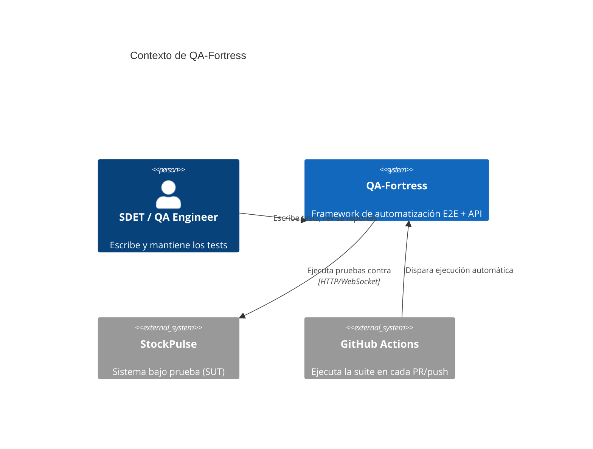
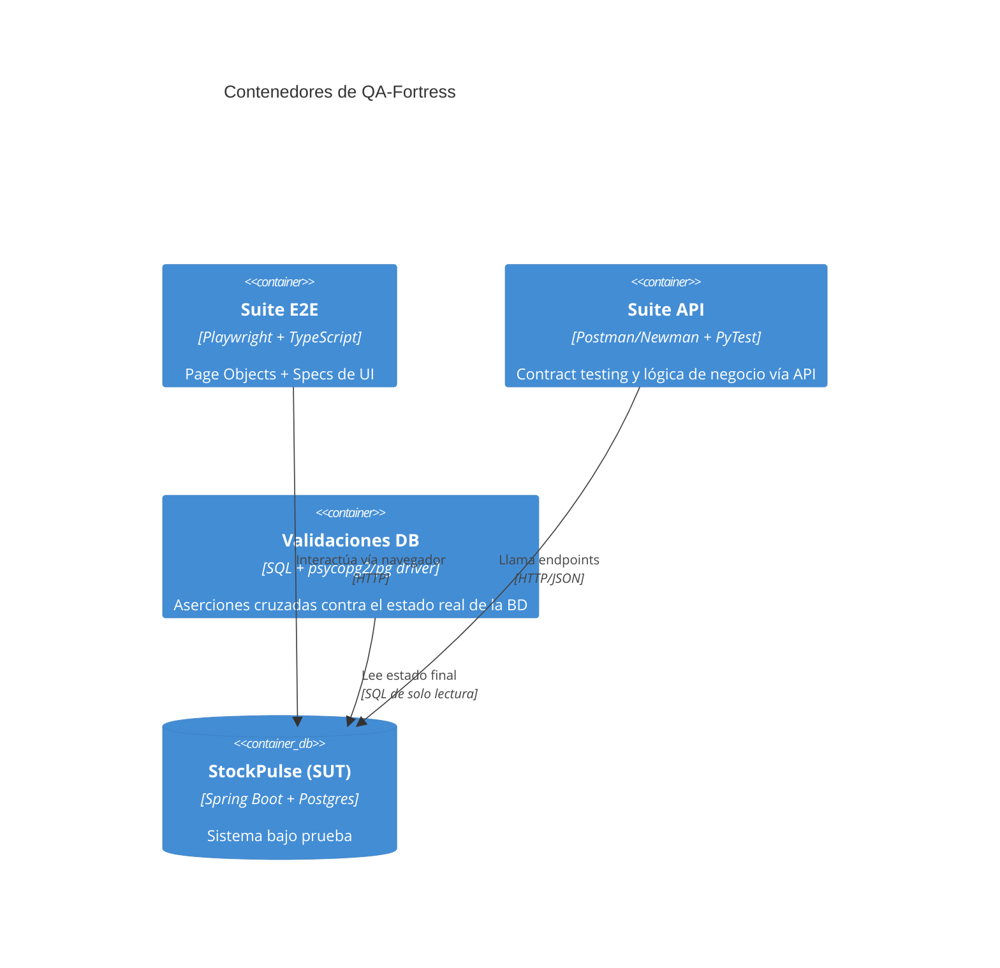
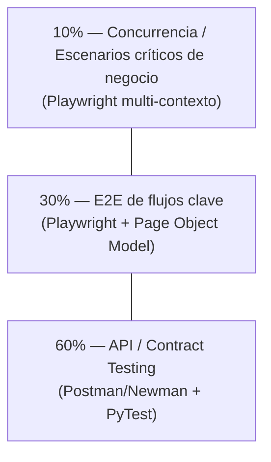
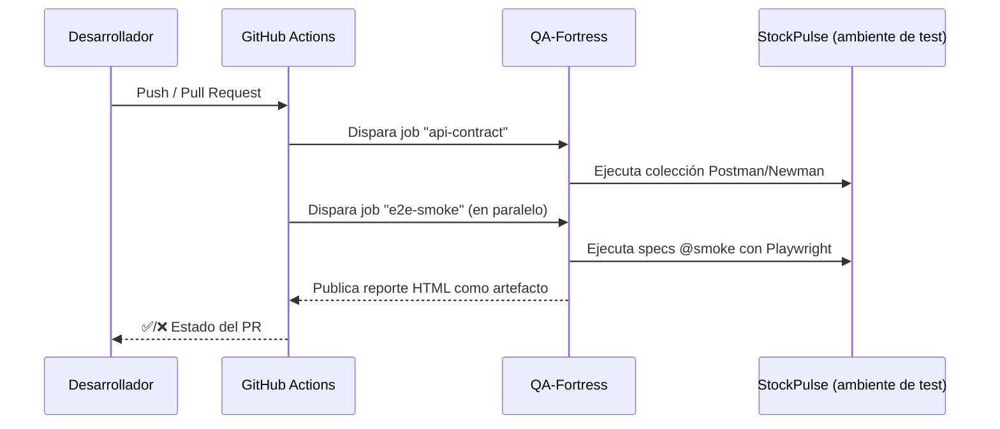

# Arquitectura — QA-Fortress

## 1. Rol dentro del ecosistema

QA-Fortress no es una aplicación con usuarios finales — es una **herramienta de ingeniería** cuyo "cliente" es el pipeline de CI/CD y el equipo de desarrollo. Su arquitectura se diseña para maximizar mantenibilidad y velocidad de feedback, no experiencia de usuario final.

## 2. Capas del framework

## 3. Pirámide de pruebas aplicada al proyecto

## 4. Flujo de ejecución en CI

## 5. Decisiones de arquitectura

| # | Decisión | Alternativa descartada | Justificación |
|---|---|---|---|
| ADR-01 | Page Object Model estricto | Selectores inline en cada spec | Un cambio de UI se corrige en un solo archivo, no en decenas de specs |
| ADR-02 | Setup de datos vía API, nunca vía UI | Crear datos de prueba navegando la UI | Tests más rápidos y no acoplados a bugs de UI ajenos al test que se está corriendo |
| ADR-03 | Doble suite API: Postman (contract) + PyTest (lógica) | Solo Postman o solo PyTest | Postman es más rápido para contract testing visual; PyTest permite lógica de aserción más compleja y reutilización de fixtures |
| ADR-04 | Aserciones cruzadas UI/API + DB | Confiar solo en lo que muestra la pantalla | La UI puede "mentir" (cachear, mostrar estado stale); la DB es la fuente de verdad |
| ADR-05 | Tags de ejecución (`@smoke`, `@regression`, `@concurrency`) | Un solo comando que corre todo siempre | Permite feedback rápido en cada push (smoke) y cobertura completa solo en PR a `main` |

## 6. Referencias cruzadas

- `docs/requirements-functional.md` — capacidades que el framework debe soportar
- `docs/requirements-non-functional.md` — tiempos de ejecución, flakiness, paralelización
- `docs/user-stories.md` — historias desde la perspectiva del SDET
- `docs/test-cases.md` — matriz de trazabilidad de casos de prueba